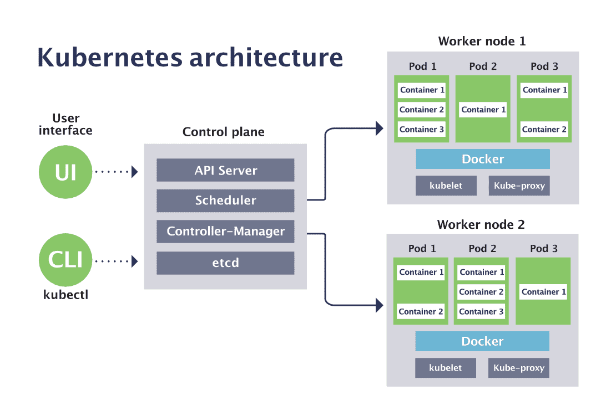

Kubernetes

Kubernetes is an open-source platform that automates the deployment, scaling, and operation of application containers across a cluster of servers. Originally developed by Google, it is now maintained by the Cloud Native Computing Foundation.

Key Concepts and Components

Pods:
- Smallest deployable units in Kubernetes.
- Group of one or more containers with shared storage/network resources.
- Ephemeral, created and destroyed to match cluster state specifications.

Nodes:
- Physical or virtual machines in the Kubernetes cluster.

Each node runs:
- Kubelet: Manages communication between the Kubernetes Master and the node, handles pods and containers.
- Container Runtime: Software to run containers (e.g., Docker, containerd).
- kube-proxy: Network proxy reflecting Kubernetes networking services on each node.

Control Plane (Master):
- kube-apiserver: Gateway to the cluster, handles and routes internal API calls.
- etcd: Key-value store for all cluster data.
- kube-scheduler: Assigns newly created pods to nodes based on resource availability.
- kube-controller-manager: Runs controller processes for routine cluster 

tasks:
- Node Controller: Notifies the cluster of node failures.
- Replication Controller: Maintains correct number of pod replicas.
- Endpoints Controller: Joins Services and Pods.
- Service Account & Token Controllers: Creates default accounts and API access tokens.
- cloud-controller-manager: Integrates with cloud provider's API, separates - cloud platform interactions from cluster interactions.

Kubernetes API:
- Users manage and orchestrate containers through the Kubernetes API.
- Exposes the control plane and acts as the front end.

Services:
- Abstraction defining a logical set of Pods and access policies.
- Enable network access to pods, consistent and discoverable within the cluster.

Volumes:
- Provides a filesystem for data persistence beyond the life of a pod.

Namespaces:
- Supports multiple virtual clusters (namespaces) within the same physical cluster.
- Partitions resources into logically named groups, providing scope and resource limits.

How Kubernetes Operates:
- Deployment: Desired state of application defined in YAML or JSON manifest (e.g., replicas, container images).
- Scheduling: Scheduler assigns instances based on resource availability across nodes.
- Orchestration: Control plane manages lifecycle and scaling of containers based on user-defined workloads.
- Service Discovery and Load Balancing: Exposes containers using DNS names or IP addresses, load balances traffic.
- Storage Orchestration: Automatically mounts storage systems (local, cloud, etc.).
- Automate Rollouts and Rollbacks: Describes desired state for containers, Kubernetes manages state changes at a controlled rate.
- Self-healing: Restarts failing containers, replaces containers, kills non-responsive containers, and manages readiness.

Benefits:
- Extensibility: Designed to be extensible with plugins and custom resources.
- Fault-Tolerance: Ensures high availability and reliability.
- Scalability: Automatically handles application scaling and resource management.
- Resource Efficiency: Optimizes resource usage across distributed infrastructure.