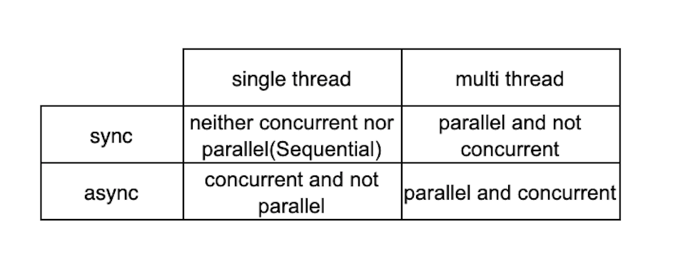

## Concurrency and parallelism 


Concurrency and parallelism are related concepts in computing but are not the same. Here’s a detailed explanation of each:

### Concurrency
- Definition: Concurrency is the ability to handle multiple tasks at the same time. It involves managing multiple tasks that are in progress simultaneously, but not necessarily executing them at the same time.
- Context: In a single-core CPU, concurrency can be achieved by interleaving execution, where the CPU switches between tasks rapidly (time slicing).
- Example: Consider a web server handling multiple client requests. Even if the server has a single core, it can manage multiple requests by quickly switching between them, giving the appearance that all requests are being processed simultaneously.

### Parallelism
- Definition: Parallelism is the simultaneous execution of multiple tasks. It requires multiple processors or cores to execute multiple tasks at the same time.
- Context: In a multi-core CPU, parallelism can be achieved by running different tasks on different cores simultaneously.
- Example: In a multi-core system, a data processing application can divide a large dataset into smaller chunks and process each chunk on a different core at the same time.

### Key Differences
- Execution: Concurrency involves managing multiple tasks by time-sharing, whereas parallelism involves executing multiple tasks simultaneously.
- Requirements: Concurrency does not necessarily require multiple processors or cores, while parallelism does.
- Example Analogy:
  - Concurrency: Like a single cashier handling multiple customers by switching between them quickly.
  - Parallelism: Like multiple cashiers each handling a different customer simultaneously.

### Concurrency and Parallelism in Practice
- Concurrency:
  - Programming Languages: Languages like Python (with threads and async I/O) and Java (with threads) support concurrency.
  - Frameworks: Node.js uses an event-driven, non-blocking I/O model to handle concurrency.
- Parallelism:
  - Programming Models: Models like OpenMP and MPI in C/C++ support parallelism.
  - Frameworks: Apache Spark can perform parallel data processing across multiple nodes in a cluster.

### Combining Concurrency and Parallelism
- Example: In a multi-core system, a server application might use concurrency to manage multiple connections (switching between tasks) and parallelism to handle data processing tasks simultaneously across multiple cores.

Understanding the distinction between concurrency and parallelism is crucial for designing efficient and responsive software systems. Concurrency improves responsiveness and resource utilization, while parallelism enhances throughput and computational speed.


## Concurrency, Parallel Execution, Parallel Concurrent Execution, and Parallelism: Detailed Explanation

Concurrency and parallelism are fundamental concepts in computing, particularly in the context of multi-threading and multi-processing. Understanding these concepts is crucial for designing efficient and scalable applications.

### Concurrency

#### Definition
Concurrency refers to the ability of a system to handle multiple tasks simultaneously by managing the execution of tasks in overlapping time periods. It doesn't necessarily mean that tasks are executed at the same time; rather, it involves interleaving execution steps of different tasks to improve efficiency and responsiveness.

#### Characteristics
- **Interleaved Execution**: Tasks are divided into smaller steps, and the steps from different tasks are interleaved.
- **Single-Core or Multi-Core**: Concurrency can occur on a single-core processor by time-slicing (context switching) or on multi-core processors.
- **Non-Deterministic Order**: The exact order of execution can vary, leading to potential race conditions if not properly managed.

#### Example
Imagine a web server handling multiple requests from different users. The server can manage multiple requests concurrently by interleaving their processing steps, ensuring responsiveness without waiting for one request to complete before starting another.

### Parallel Execution

#### Definition
Parallel execution refers to the simultaneous execution of multiple tasks. This requires multiple processors or cores to execute tasks literally at the same time.

#### Characteristics
- **Simultaneous Execution**: Multiple tasks are executed at the exact same time.
- **Requires Multi-Core Processors**: Effective parallel execution relies on having multiple cores or processors.
- **Improves Throughput**: Parallel execution can significantly improve the throughput of a system by leveraging multiple cores.

#### Example
In a multi-core CPU, parallel execution can occur when different cores execute different tasks or parts of a task simultaneously.

### Parallel Concurrent Execution

#### Definition
Parallel concurrent execution combines the concepts of concurrency and parallelism. It involves multiple tasks being executed concurrently, with some of them possibly being executed in parallel.

#### Characteristics
- **Combines Concurrency and Parallelism**: Tasks are divided into smaller steps and managed concurrently, with some steps being executed in parallel.
- **Scalable**: Scales with the number of cores or processors, improving both responsiveness and throughput.
- **Complex Coordination**: Requires careful coordination to manage both interleaving (concurrency) and simultaneous execution (parallelism).

#### Example
A multi-threaded application running on a multi-core processor where each thread handles a part of a task. The threads are executed concurrently, and the underlying hardware executes some of these threads in parallel on different cores.

### Parallelism

#### Definition
Parallelism is a specific type of concurrency where tasks are executed simultaneously, leveraging multiple processors or cores to perform multiple operations at the same time.

#### Characteristics
- **Focus on Simultaneity**: Emphasizes performing multiple operations simultaneously.
- **Hardware Dependent**: Requires hardware support with multiple cores or processors.
- **High Throughput**: Effective for tasks that can be divided into independent subtasks.

#### Example
Running a matrix multiplication operation where different parts of the matrix are processed simultaneously on different cores.

### Detailed Comparisons and Examples

#### Concurrency Example (Python)

Using threads to achieve concurrency in Python:
```python
import threading
import time

def print_numbers():
    for i in range(5):
        print(i)
        time.sleep(1)

def print_letters():
    for char in 'abcde':
        print(char)
        time.sleep(1)

# Create threads
t1 = threading.Thread(target=print_numbers)
t2 = threading.Thread(target=print_letters)

# Start threads
t1.start()
t2.start()

# Wait for threads to complete
t1.join()
t2.join()
```
In this example, `print_numbers` and `print_letters` functions are executed concurrently, with their execution steps interleaved.

#### Parallel Execution Example (Python)

Using multiprocessing to achieve parallel execution in Python:
```python
import multiprocessing
import time

def print_numbers():
    for i in range(5):
        print(i)
        time.sleep(1)

def print_letters():
    for char in 'abcde':
        print(char)
        time.sleep(1)

# Create processes
p1 = multiprocessing.Process(target=print_numbers)
p2 = multiprocessing.Process(target=print_letters)

# Start processes
p1.start()
p2.start()

# Wait for processes to complete
p1.join()
p2.join()
```
In this example, `print_numbers` and `print_letters` functions are executed in parallel, with each function running in a separate process.

#### Parallel Concurrent Execution Example (Java)

Using a thread pool to achieve parallel concurrent execution in Java:
```java
import java.util.concurrent.ExecutorService;
import java.util.concurrent.Executors;

public class ParallelConcurrentExample {
    public static void main(String[] args) {
        ExecutorService executor = Executors.newFixedThreadPool(2);

        Runnable printNumbers = () -> {
            for (int i = 0; i < 5; i++) {
                System.out.println(i);
                try {
                    Thread.sleep(1000);
                } catch (InterruptedException e) {
                    e.printStackTrace();
                }
            }
        };

        Runnable printLetters = () -> {
            for (char c = 'a'; c <= 'e'; c++) {
                System.out.println(c);
                try {
                    Thread.sleep(1000);
                } catch (InterruptedException e) {
                    e.printStackTrace();
                }
            }
        };

        executor.submit(printNumbers);
        executor.submit(printLetters);

        executor.shutdown();
    }
}
```
In this example, two tasks are submitted to a thread pool with two threads, achieving parallel concurrent execution where tasks run concurrently and some parts of the tasks may be executed in parallel.

### Summary

- **Concurrency**: Multiple tasks are managed by interleaving their execution. They may not necessarily run simultaneously but are designed to make progress within the same time frame.
- **Parallel Execution**: Multiple tasks are executed simultaneously using multiple processors or cores. It focuses on actual simultaneous execution.
- **Parallel Concurrent Execution**: Combines concurrency and parallelism. Tasks are divided into smaller steps and executed concurrently, with some steps being executed in parallel.
- **Parallelism**: A type of concurrency focused on simultaneous execution of multiple operations, leveraging multiple processors or cores.

Understanding these concepts and their differences is essential for designing efficient, responsive, and scalable applications. Properly utilizing concurrency and parallelism can significantly improve the performance and resource utilization of your programs.


