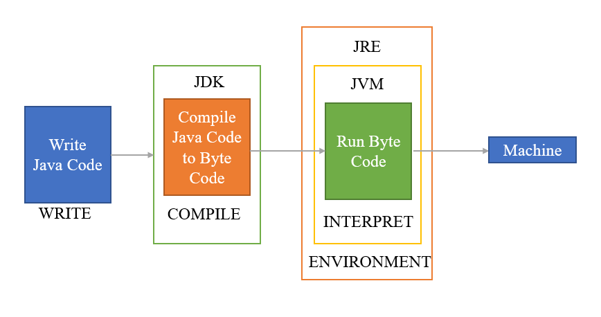

## Java




### Java: A Detailed Overview

Java is a high-level, class-based, object-oriented programming language that is designed to be platform-independent, meaning that compiled Java code can run on any device that supports the Java Runtime Environment (JRE). It was originally developed by James Gosling at Sun Microsystems and released in 1995. Since then, Java has become one of the most widely used programming languages, known for its portability, performance, and robustness.

### Key Features of Java

1. **Platform Independence**:
   - Java achieves platform independence through the use of bytecode, which is an intermediate representation of the compiled Java code. The bytecode can be executed on any platform that has a Java Virtual Machine (JVM).
   
2. **Object-Oriented**:
   - Java follows the object-oriented programming (OOP) paradigm, which promotes the use of objects and classes. Key OOP concepts in Java include inheritance, polymorphism, encapsulation, and abstraction.

3. **Simple and Familiar**:
   - Java is designed to be easy to learn and use, with a syntax that is similar to C and C++. However, it eliminates many of the complexities of C++ such as pointers and multiple inheritance.

4. **Secure**:
   - Java provides a secure environment for code execution through its robust security features, including the Java security manager and bytecode verification.

5. **Multithreaded**:
   - Java has built-in support for multithreaded programming, which allows the concurrent execution of two or more threads (lightweight processes). This makes it easier to build applications that can perform multiple tasks simultaneously.

6. **Robust and Reliable**:
   - Java is designed to be robust, with strong memory management and error-handling mechanisms. It has features like automatic garbage collection, exception handling, and type-checking to help create reliable applications.

7. **High Performance**:
   - Java achieves high performance through Just-In-Time (JIT) compilation, which converts bytecode into native machine code at runtime. This allows Java applications to run faster.

8. **Distributed**:
   - Java is designed for the distributed environment of the internet. It has built-in support for networking, enabling the development of distributed applications.

### Java Architecture

Java architecture consists of three main components:

1. **Java Development Kit (JDK)**:
   - The JDK is a software development kit used to develop Java applications. It includes tools for compiling, debugging, and running Java programs.

2. **Java Runtime Environment (JRE)**:
   - The JRE is a part of the JDK that provides the libraries, Java Virtual Machine (JVM), and other components required to run Java applications. It does not include development tools such as compilers or debuggers.

3. **Java Virtual Machine (JVM)**:
   - The JVM is an abstract computing machine that enables a computer to run Java programs. It converts Java bytecode into machine code and executes it. The JVM is platform-dependent, but the bytecode is platform-independent.

### Java Syntax and Basics

#### Hello World Example

A simple Java program that prints "Hello, World!" to the console:

```java
public class HelloWorld {
    public static void main(String[] args) {
        System.out.println("Hello, World!");
    }
}
```

#### Explanation

- **public class HelloWorld**: Declares a public class named `HelloWorld`.
- **public static void main(String[] args)**: The main method is the entry point of the program. It is declared public, static, and void.
- **System.out.println("Hello, World!")**: Prints the string "Hello, World!" to the console.

### Java Programming Concepts

#### Variables and Data Types

Java has several data types, including primitive types and reference types.

- **Primitive Types**: int, byte, short, long, float, double, char, boolean
- **Reference Types**: Objects and arrays

```java
int age = 25; // Integer
double salary = 50000.0; // Double
boolean isEmployed = true; // Boolean
char grade = 'A'; // Character
String name = "John Doe"; // String (Reference type)
```

#### Control Structures

Java supports several control structures, including if-else statements, switch statements, and loops.

- **if-else Statement**:

```java
if (age > 18) {
    System.out.println("Adult");
} else {
    System.out.println("Minor");
}
```

- **switch Statement**:

```java
switch (grade) {
    case 'A':
        System.out.println("Excellent");
        break;
    case 'B':
        System.out.println("Good");
        break;
    default:
        System.out.println("Needs Improvement");
        break;
}
```

- **Loops**:

```java
// for Loop
for (int i = 0; i < 5; i++) {
    System.out.println(i);
}

// while Loop
int i = 0;
while (i < 5) {
    System.out.println(i);
    i++;
}

// do-while Loop
int j = 0;
do {
    System.out.println(j);
    j++;
} while (j < 5);
```

### Object-Oriented Programming (OOP) in Java

#### Classes and Objects

A class is a blueprint for creating objects. An object is an instance of a class.

```java
public class Person {
    private String name;
    private int age;

    // Constructor
    public Person(String name, int age) {
        this.name = name;
        this.age = age;
    }

    // Getter for name
    public String getName() {
        return name;
    }

    // Setter for name
    public void setName(String name) {
        this.name = name;
    }

    // Getter for age
    public int getAge() {
        return age;
    }

    // Setter for age
    public void setAge(int age) {
        this.age = age;
    }

    // Method to display person details
    public void display() {
        System.out.println("Name: " + name);
        System.out.println("Age: " + age);
    }
}
```

#### Inheritance

Inheritance allows a class to inherit properties and methods from another class.

```java
// Parent class
public class Animal {
    public void eat() {
        System.out.println("This animal eats");
    }
}

// Child class
public class Dog extends Animal {
    public void bark() {
        System.out.println("The dog barks");
    }
}

// Main class to test inheritance
public class TestInheritance {
    public static void main(String[] args) {
        Dog dog = new Dog();
        dog.eat(); // Inherited method
        dog.bark(); // Child class method
    }
}
```

#### Polymorphism

Polymorphism allows objects to be treated as instances of their parent class rather than their actual class.

```java
public class Animal {
    public void sound() {
        System.out.println("This animal makes a sound");
    }
}

public class Dog extends Animal {
    @Override
    public void sound() {
        System.out.println("The dog barks");
    }
}

public class Cat extends Animal {
    @Override
    public void sound() {
        System.out.println("The cat meows");
    }
}

public class TestPolymorphism {
    public static void main(String[] args) {
        Animal myDog = new Dog();
        Animal myCat = new Cat();

        myDog.sound(); // The dog barks
        myCat.sound(); // The cat meows
    }
}
```

#### Encapsulation

Encapsulation is the bundling of data (fields) and methods that operate on the data into a single unit or class.

```java
public class Account {
    private double balance;

    public double getBalance() {
        return balance;
    }

    public void deposit(double amount) {
        if (amount > 0) {
            balance += amount;
        }
    }

    public void withdraw(double amount) {
        if (amount > 0 && amount <= balance) {
            balance -= amount;
        }
    }
}
```

#### Abstraction

Abstraction is the concept of hiding the implementation details and showing only the functionality to the user.

```java
public abstract class Vehicle {
    public abstract void start();

    public void stop() {
        System.out.println("The vehicle stops");
    }
}

public class Car extends Vehicle {
    @Override
    public void start() {
        System.out.println("The car starts");
    }
}

public class TestAbstraction {
    public static void main(String[] args) {
        Vehicle myCar = new Car();
        myCar.start(); // The car starts
        myCar.stop();  // The vehicle stops
    }
}
```

### Java Standard Libraries

Java provides a rich set of standard libraries for various functionalities, including collections, I/O, networking, and concurrency.

#### Collections Framework

The Collections Framework provides data structures such as lists, sets, and maps.

```java
import java.util.ArrayList;
import java.util.HashSet;
import java.util.HashMap;

public class TestCollections {
    public static void main(String[] args) {
        // List example
        ArrayList<String> list = new ArrayList<>();
        list.add("Apple");
        list.add("Banana");
        System.out.println(list);

        // Set example
        HashSet<String> set = new HashSet<>();
        set.add("Apple");
        set.add("Banana");
        set.add("Apple"); // Duplicate element
        System.out.println(set);

        // Map example
        HashMap<String, Integer> map = new HashMap<>();
        map.put("Apple", 10);
        map.put("Banana", 20);
        System.out.println(map);
    }
}
```

####

## Concepts in Java

Java is a versatile and widely-used programming language that provides many features for building robust, secure, and scalable applications. Here are the most important concepts of Java that every developer should understand:

### 1. Object-Oriented Programming (OOP)
   - Classes and Objects: Fundamental building blocks in Java. A class is a blueprint for objects, and objects are instances of classes.
   - Inheritance: Mechanism by which one class can inherit fields and methods from another class.
   - Polymorphism: Ability of different classes to respond to the same method call in different ways.
   - Encapsulation: Bundling of data (fields) and methods that operate on the data into a single unit (class), and restricting access to some of the object's components.
   - Abstraction: Hiding the complex implementation details and showing only the necessary features of an object.

### 2. Data Types and Variables
   - Primitive Data Types: `int`, `float`, `double`, `char`, `boolean`, `byte`, `short`, `long`.
   - Reference Data Types: Objects and arrays.
   - Variables: Containers for storing data values. Can be local, instance, or static.

### 3. Control Flow Statements
   - Conditional Statements: `if`, `else if`, `else`, `switch`.
   - Loops: `for`, `while`, `do-while`.
   - Branching Statements: `break`, `continue`, `return`.

### 4. Methods (Functions)
   - Method Declaration: Defining a method with a return type, method name, and parameters.
   - Method Overloading: Defining multiple methods with the same name but different parameter lists.
   - Method Overriding: Redefining a method in a subclass that already exists in the parent class.

### 5. Exception Handling
   - Try-Catch Blocks: Mechanism to handle runtime errors.
   - Finally Block: Block that executes regardless of whether an exception is thrown or not.
   - Throw and Throws: Keywords to throw an exception explicitly and declare exceptions, respectively.
   - Custom Exceptions: Creating user-defined exceptions by extending the `Exception` class.

### 6. Collections Framework
   - List: `ArrayList`, `LinkedList`.
   - Set: `HashSet`, `TreeSet`, `LinkedHashSet`.
   - Map: `HashMap`, `TreeMap`, `LinkedHashMap`.
   - Queue: `PriorityQueue`, `LinkedList`.

### 7. Generics
   - Generic Classes and Methods: Enable types (classes and interfaces) to be parameters when defining classes, interfaces, and methods.
   - Bounded Type Parameters: Restrict the types that can be used as type arguments.

### 8. Multithreading and Concurrency
   - Thread Class and Runnable Interface: Creating and managing threads.
   - Synchronization: Ensuring that multiple threads can safely access shared resources.
   - Concurrency Utilities: `ExecutorService`, `Callable`, `Future`, `Concurrent Collections`.

### 9. Input and Output (I/O)
   - Streams: `InputStream`, `OutputStream`, `FileInputStream`, `FileOutputStream`.
   - Readers and Writers: `FileReader`, `FileWriter`, `BufferedReader`, `BufferedWriter`.
   - Serialization: Converting objects into a byte stream and vice versa.

### 10. Java Standard Libraries (APIs)
   - Java.lang: Basic language features like `String`, `Math`, `Object`.
   - Java.util: Utility classes like collections framework, date and time facilities, random number generation.
   - Java.io: Input and output through data streams, serialization.
   - Java.nio: Non-blocking I/O operations.
   - Java.net: Networking functionalities.

### 11. Java Memory Management
   - Garbage Collection: Automatic memory management to reclaim memory used by objects that are no longer referenced.
   - Heap and Stack: Memory areas where objects and method calls/variables are stored, respectively.

### 12. Annotations
   - Built-in Annotations: `@Override`, `@Deprecated`, `@SuppressWarnings`.
   - Custom Annotations: Creating your own annotations.

### 13. Java Development Tools
   - JDK (Java Development Kit): Tools needed to develop Java applications, including the Java compiler (javac).
   - JVM (Java Virtual Machine): Executes Java bytecode on any platform.
   - IDEs (Integrated Development Environments): Tools like IntelliJ IDEA, Eclipse, and NetBeans that help in writing and managing Java code.

### 14. Java Frameworks and Libraries
   - Spring Framework: For building enterprise applications.
   - Hibernate: For ORM (Object-Relational Mapping).
   - Apache Maven and Gradle: Build automation tools.

### 15. Functional Programming in Java
   - Lambda Expressions: Introduced in Java 8 for concise syntax for anonymous functions.
   - Streams API: For processing sequences of elements (collections) in a functional style.

### 16. JDBC (Java Database Connectivity)
   - Connecting to Databases: Using JDBC API to connect and interact with databases.
   - Executing Queries: Performing SQL operations through Java code.

### Conclusion

Understanding these core concepts of Java is essential for leveraging its full potential in building robust, efficient, and scalable applications. Each concept plays a crucial role in various aspects of software development, making Java a powerful tool in the hands of developers.


## Java Components

Java code is composed of several key components that together form the structure and functionality of a Java application. Understanding these components is crucial for writing, reading, and maintaining Java programs. Here are the different components of Java code in detail:

### 1. Packages

Description:
- Packages are namespaces that organize classes and interfaces into a structured directory hierarchy.

Syntax:
```java
package com.example.myapp;
```

Use Cases:
- Avoiding name conflicts.
- Grouping related classes and interfaces.
- Managing access control.

### 2. Imports

Description:
- Import statements allow the use of classes and interfaces from other packages.

Syntax:
```java
import java.util.List;
import java.util.ArrayList;
```

Use Cases:
- Accessing standard Java library classes.
- Using third-party libraries.
- Referencing user-defined classes from other packages.

### 3. Classes

Description:
- Classes are the blueprint for creating objects. They encapsulate data and behavior.

Syntax:
```java
public class MyClass {
    // class body
}
```

Components:
- Fields: Variables that hold data.
- Methods: Functions that define behavior.
- Constructors: Special methods to initialize objects.
- Nested Classes: Classes defined within another class.

### 4. Fields

Description:
- Fields (or member variables) are used to store the state of an object.

Syntax:
```java
public class MyClass {
    private int age;
    public String name;
}
```

Use Cases:
- Representing the properties of an object.
- Sharing data among methods within the same class.

### 5. Methods

Description:
- Methods define the behavior of objects and perform operations.

Syntax:
```java
public class MyClass {
    public void display() {
        System.out.println("Hello, World!");
    }
}
```

Types:
- Instance Methods: Operate on instances of the class.
- Static Methods: Belong to the class rather than instances.

### 6. Constructors

Description:
- Constructors are special methods called when an object is instantiated. They initialize the object's state.

Syntax:
```java
public class MyClass {
    public MyClass() {
        // Constructor body
    }
}
```

Use Cases:
- Setting initial values for fields.
- Performing any setup required for the object.

### 7. Main Method

Description:
- The `main` method is the entry point of any Java application.

Syntax:
```java
public class MyClass {
    public static void main(String[] args) {
        // Code to be executed
    }
}
```

Use Cases:
- Starting point of standalone Java applications.
- Invoking other classes and methods.

### 8. Interfaces

Description:
- Interfaces define a contract that classes can implement. They contain abstract methods.

Syntax:
```java
public interface MyInterface {
    void performAction();
}
```

Use Cases:
- Achieving abstraction.
- Defining methods that multiple classes can implement.

### 9. Inheritance

Description:
- Inheritance allows one class to inherit fields and methods from another class.

Syntax:
```java
public class SubClass extends SuperClass {
    // SubClass body
}
```

Use Cases:
- Reusing existing code.
- Establishing a relationship between classes.

### 10. Annotations

Description:
- Annotations provide metadata about the code and are used for various purposes like configuration and compiler instructions.

Syntax:
```java
public class MyClass {
    @Override
    public String toString() {
        return "MyClass";
    }
}
```

Use Cases:
- Marking methods for overriding.
- Providing metadata for frameworks like Spring or JPA.

### 11. Access Modifiers

Description:
- Access modifiers control the visibility of classes, methods, and fields.

Types:
- `public`: Accessible from anywhere.
- `protected`: Accessible within the same package and subclasses.
- `default` (no modifier): Accessible within the same package.
- `private`: Accessible only within the same class.

Syntax:
```java
public class MyClass {
    private int age;
    protected String name;
    int id; // default
    public void display() {
        // Method body
    }
}
```

### 12. Exception Handling

Description:
- Exception handling provides a way to manage runtime errors and maintain normal application flow.

Syntax:
```java
public class MyClass {
    public void riskyMethod() {
        try {
            // Code that may throw an exception
        } catch (Exception e) {
            // Handle exception
        } finally {
            // Cleanup code
        }
    }
}
```

Components:
- `try`: Block of code that might throw an exception.
- `catch`: Block to handle exceptions.
- `finally`: Block that executes regardless of whether an exception was thrown or not.

### 13. Generics

Description:
- Generics provide a way to create classes, interfaces, and methods with type parameters.

Syntax:
```java
public class Box<T> {
    private T value;
    public void set(T value) {
        this.value = value;
    }
    public T get() {
        return value;
    }
}
```

Use Cases:
- Creating type-safe collections and utility classes.

### 14. Comments

Description:
- Comments provide explanations and notes within the code.

Types:
- Single-line: `// This is a single-line comment`
- Multi-line: `/* This is a multi-line comment */`
- Javadoc: `/ This is a Javadoc comment */`

Use Cases:
- Documenting code.
- Adding explanations and notes for developers.

### 15. Lambda Expressions

Description:
- Lambda expressions provide a concise way to represent anonymous functions (functions without a name).

Syntax:
```java
List<String> names = Arrays.asList("John", "Jane", "Jack");
names.forEach(name -> System.out.println(name));
```

Use Cases:
- Functional programming with the Java Streams API.
- Implementing functional interfaces.

### 16. Streams API

Description:
- Streams provide a way to process sequences of elements with operations such as filter, map, and reduce.

Syntax:
```java
List<String> names = Arrays.asList("John", "Jane", "Jack");
names.stream()
     .filter(name -> name.startsWith("J"))
     .map(String::toUpperCase)
     .forEach(System.out::println);
```

Use Cases:
- Performing bulk operations on collections.

### Conclusion

Understanding these components of Java code is essential for developing robust, efficient, and maintainable Java applications. Each component plays a specific role in the structure and functionality of Java programs, and mastering these concepts is key to becoming proficient in Java programming.


## Getter and Setter Methods in Java

In Java, getter and setter methods are used to access and modify the private fields of a class. These methods provide a way to encapsulate the fields, ensuring controlled access and protecting the data from unauthorized modifications.

### Encapsulation in Java

Encapsulation is one of the fundamental principles of Object-Oriented Programming (OOP). It involves wrapping the data (fields) and the code (methods) that operates on the data into a single unit, usually a class. This mechanism helps in hiding the internal state of the object and only exposing a controlled interface.

### Defining Getter and Setter Methods

#### Syntax

1. **Getter Method**:
   - A getter method is used to retrieve the value of a field.
   - The naming convention is `getFieldName()`.

   ```java
   public returnType getFieldName() {
       return fieldName;
   }
   ```

2. **Setter Method**:
   - A setter method is used to set or update the value of a field.
   - The naming convention is `setFieldName()`.

   ```java
   public void setFieldName(parameterType fieldName) {
       this.fieldName = fieldName;
   }
   ```

### Example: Getter and Setter Methods

Consider a `Person` class with private fields `name` and `age`.

```java
public class Person {
    // Private fields
    private String name;
    private int age;

    // Getter method for name
    public String getName() {
        return name;
    }

    // Setter method for name
    public void setName(String name) {
        this.name = name;
    }

    // Getter method for age
    public int getAge() {
        return age;
    }

    // Setter method for age
    public void setAge(int age) {
        if (age > 0) { // Validation example
            this.age = age;
        } else {
            System.out.println("Age must be a positive number");
        }
    }

    public static void main(String[] args) {
        // Create a Person object
        Person person = new Person();

        // Set values using setter methods
        person.setName("John Doe");
        person.setAge(25);

        // Get values using getter methods
        System.out.println("Name: " + person.getName());
        System.out.println("Age: " + person.getAge());
    }
}
```

### Explanation

1. **Private Fields**:
   - The fields `name` and `age` are declared as private. This ensures that they cannot be accessed directly from outside the class.

   ```java
   private String name;
   private int age;
   ```

2. **Getter Methods**:
   - The `getName` method returns the value of the `name` field.
   - The `getAge` method returns the value of the `age` field.

   ```java
   public String getName() {
       return name;
   }

   public int getAge() {
       return age;
   }
   ```

3. **Setter Methods**:
   - The `setName` method sets the value of the `name` field.
   - The `setAge` method sets the value of the `age` field. It also includes validation to ensure that age is a positive number.

   ```java
   public void setName(String name) {
       this.name = name;
   }

   public void setAge(int age) {
       if (age > 0) {
           this.age = age;
       } else {
           System.out.println("Age must be a positive number");
       }
   }
   ```

4. **Using Getter and Setter Methods**:
   - In the `main` method, we create a `Person` object and use the setter methods to set the values of `name` and `age`.
   - We then use the getter methods to retrieve and print these values.

   ```java
   public static void main(String[] args) {
       Person person = new Person();
       person.setName("John Doe");
       person.setAge(25);
       System.out.println("Name: " + person.getName());
       System.out.println("Age: " + person.getAge());
   }
   ```

### Benefits of Using Getter and Setter Methods

1. **Encapsulation**: Getter and setter methods allow you to encapsulate the fields of a class, hiding the internal state and providing a controlled interface for accessing and modifying the data.

2. **Validation**: Setters can include validation logic to ensure that the data being set is valid. For example, the `setAge` method checks that the age is a positive number.

3. **Read-Only and Write-Only Fields**: By providing only getters or only setters, you can make fields read-only or write-only. For example, you could omit the setter for `name` to make it a read-only property.

4. **Flexibility**: If the internal representation of a field changes, you can update the getter and setter methods without changing the external interface. This provides flexibility in maintaining and evolving the code.

### Conclusion

Getter and setter methods are essential tools in Java for encapsulating fields, validating data, and providing controlled access to the internal state of an object. By using these methods, you can create more robust, maintainable, and flexible classes, adhering to the principles of object-oriented programming.


## Annotations in Java

Annotations are a powerful feature in Java that allow you to add metadata to your code. Metadata is information about the code that is not part of the program itself but can be used by the compiler, tools, or runtime environments to provide additional functionality. Annotations provide a way to associate this metadata with classes, methods, fields, parameters, and other elements of the Java code.

### Purpose of Annotations

1. **Documentation**: Annotations can be used to generate documentation.
2. **Compilation**: They can influence the behavior of the compiler.
3. **Runtime Processing**: Annotations can be used by tools and libraries at runtime to perform various tasks such as dependency injection, aspect-oriented programming, and configuration.

### Built-in Annotations

Java provides several built-in annotations which are commonly used:

1. **@Override**
   - Indicates that a method is intended to override a method in a superclass.
   ```java
   @Override
   public String toString() {
       return "Example";
   }
   ```

2. **@Deprecated**
   - Marks a method or class as deprecated, indicating that it should no longer be used.
   ```java
   @Deprecated
   public void oldMethod() {
       // Do something
   }
   ```

3. **@SuppressWarnings**
   - Instructs the compiler to suppress specific warnings.
   ```java
   @SuppressWarnings("unchecked")
   public void myMethod() {
       List rawList = new ArrayList();
   }
   ```

4. **@SafeVarargs**
   - Suppresses warnings about potentially unsafe varargs (variable-length argument) usage.
   ```java
   @SafeVarargs
   public final void mySafeVarargsMethod(List<String>... lists) {
       // Do something
   }
   ```

5. **@FunctionalInterface**
   - Indicates that an interface is intended to be a functional interface, which has exactly one abstract method.
   ```java
   @FunctionalInterface
   public interface MyFunctionalInterface {
       void execute();
   }
   ```

### Meta-Annotations

Meta-annotations are annotations that apply to other annotations. Java provides several meta-annotations to define the behavior of annotations:

1. **@Retention**
   - Specifies how long annotations with the annotated type are to be retained.
   ```java
   @Retention(RetentionPolicy.RUNTIME)
   public @interface MyAnnotation {
       // elements
   }
   ```
   - **RetentionPolicy values**:
     - `SOURCE`: Annotations are discarded by the compiler.
     - `CLASS`: Annotations are recorded in the class file but not available at runtime.
     - `RUNTIME`: Annotations are recorded in the class file and available at runtime.

2. **@Target**
   - Specifies the kinds of elements an annotation type can be applied to.
   ```java
   @Target(ElementType.METHOD)
   public @interface MyMethodAnnotation {
       // elements
   }
   ```
   - **ElementType values**:
     - `TYPE`: Class, interface (including annotation type), or enum declaration.
     - `FIELD`: Field (including enum constant).
     - `METHOD`: Method.
     - `PARAMETER`: Parameter.
     - `CONSTRUCTOR`: Constructor.
     - `LOCAL_VARIABLE`: Local variable declaration.
     - `ANNOTATION_TYPE`: Annotation type.
     - `PACKAGE`: Package declaration.
     - `TYPE_PARAMETER`: Type parameter declaration.
     - `TYPE_USE`: Use of a type.

3. **@Documented**
   - Indicates that an annotation type should be documented by tools like Javadoc.
   ```java
   @Documented
   public @interface MyDocumentedAnnotation {
       // elements
   }
   ```

4. **@Inherited**
   - Indicates that an annotation type is automatically inherited.
   ```java
   @Inherited
   @Retention(RetentionPolicy.RUNTIME)
   @Target(ElementType.TYPE)
   public @interface MyInheritedAnnotation {
       // elements
   }
   ```

### Custom Annotations

You can define your own annotations by using the `@interface` keyword. Here’s an example:

#### Example

1. **Define a Custom Annotation**:

```java
import java.lang.annotation.ElementType;
import java.lang.annotation.Retention;
import java.lang.annotation.RetentionPolicy;
import java.lang.annotation.Target;

@Retention(RetentionPolicy.RUNTIME)
@Target(ElementType.METHOD)
public @interface MyCustomAnnotation {
    String value();
}
```

2. **Apply the Custom Annotation**:

```java
public class MyClass {

    @MyCustomAnnotation(value = "Hello, Annotation!")
    public void myMethod() {
        System.out.println("My method is called");
    }
}
```

3. **Process the Annotation at Runtime**:

```java
import java.lang.reflect.Method;

public class AnnotationProcessor {

    public static void main(String[] args) {
        try {
            Method method = MyClass.class.getMethod("myMethod");

            if (method.isAnnotationPresent(MyCustomAnnotation.class)) {
                MyCustomAnnotation annotation = method.getAnnotation(MyCustomAnnotation.class);
                System.out.println("Annotation value: " + annotation.value());
            }

            // Call the method to see its output
            MyClass myClass = new MyClass();
            myClass.myMethod();

        } catch (NoSuchMethodException e) {
            e.printStackTrace();
        }
    }
}
```

### Explanation

1. **Define a Custom Annotation**:
   - `@Retention(RetentionPolicy.RUNTIME)`: The annotation is available at runtime.
   - `@Target(ElementType.METHOD)`: The annotation can be applied to methods.
   - `public @interface MyCustomAnnotation`: Defines the custom annotation.

2. **Apply the Custom Annotation**:
   - `@MyCustomAnnotation(value = "Hello, Annotation!")`: Applies the custom annotation to the method `myMethod`.

3. **Process the Annotation at Runtime**:
   - `Method method = MyClass.class.getMethod("myMethod");`: Retrieves the method.
   - `method.isAnnotationPresent(MyCustomAnnotation.class)`: Checks if the annotation is present.
   - `MyCustomAnnotation annotation = method.getAnnotation(MyCustomAnnotation.class);`: Retrieves the annotation.
   - `System.out.println("Annotation value: " + annotation.value());`: Prints the value of the annotation.

### Conclusion

Annotations in Java provide a powerful way to add metadata to your code, influencing both compilation and runtime behavior. By understanding and utilizing built-in annotations, meta-annotations, and custom annotations, you can create more expressive and maintainable Java applications. Annotations are widely used in frameworks and libraries, making them an essential tool for modern Java development.


